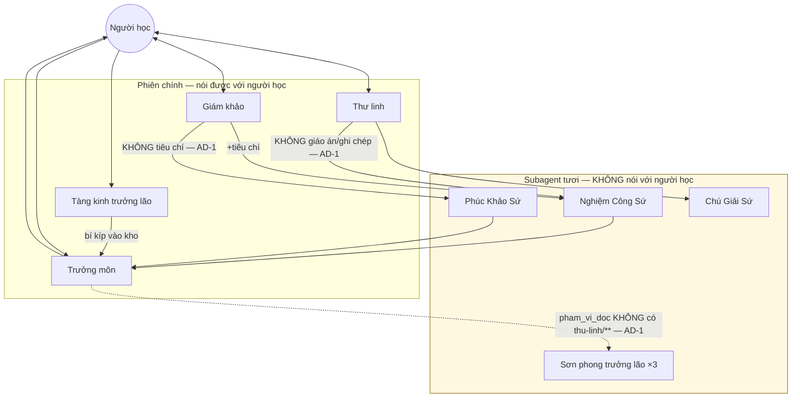
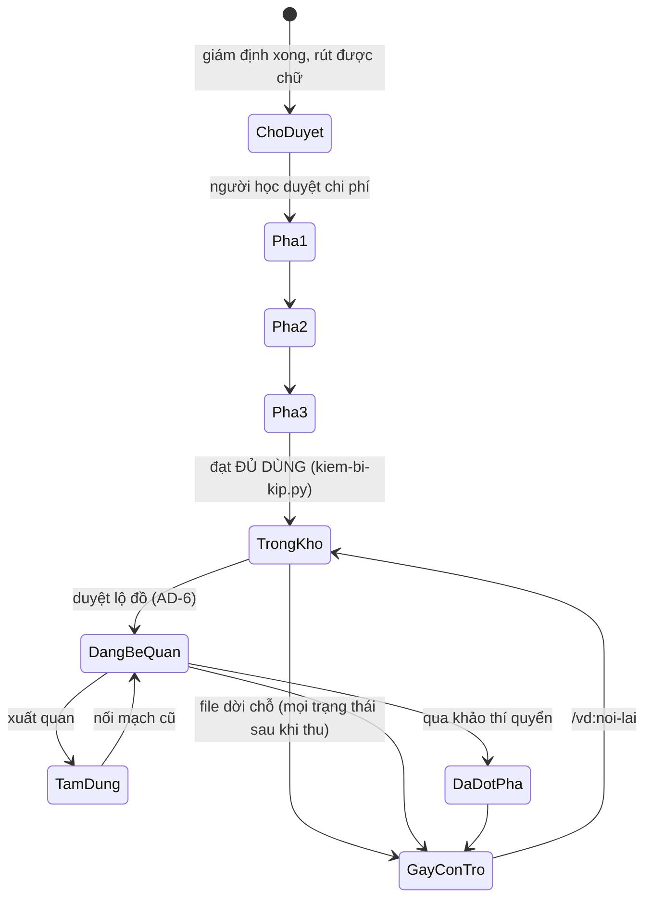

# Architecture Spine — Vấn Đạo

## Design Paradigm

**Actor model cách ly** — tám vai (+ đệ tử) là các tác nhân biệt lập, giao tiếp **thuần qua thông điệp** (thư, hộp thư `ban-giao/thu/`), không bao giờ đọc bộ nhớ trong của nhau. Bốn vai chấm (`nghiem-cong`, `phuc-khao`, `truong-lao`, `chu-giai`) là **subagent tươi** — ngữ cảnh mới mỗi lần gọi, **không bao giờ fork** phiên đang chạy; bốn vai còn lại (Trưởng môn, Tàng kinh trưởng lão, Thư linh, Giám khảo) là skill chạy trong phiên chính, nói được với người học.

**Event-sourcing cho trạng thái** — không có file trạng thái tổng nào bị sửa tại chỗ. Mọi đổi trạng thái là **thêm một dòng mới** vào log (`.jsonl`); trạng thái hiện tại luôn **suy từ dòng gần nhất**, không lưu cờ có thể lệch. `ban-do.json` là cache dựng lại được, xoá lúc nào cũng an toàn.

Hai paradigm này khớp nhau: actor cách ly cần lịch sử bất biến để không ai "sửa hộ" trạng thái của actor khác — event log là cách duy nhất actor A biết chuyện gì đã xảy ra ở vùng của actor B mà không cần đọc bộ nhớ trong của B.

## Invariants & Rules

### AD-1 — Actor cách ly, thông điệp tối thiểu [ADOPTED]

- **Binds:** tất cả 8 vai + đệ tử (all)
- **Prevents:** một vai suy luận dựa trên dữ liệu đáng lẽ không thấy được (rò rỉ ngữ cảnh phá vỡ tính độc lập của việc soát)
- **Rule:** mỗi cạnh giao tiếp giữa hai vai khai rõ **những gì KHÔNG mang theo**, không chỉ những gì mang theo. Năm cạnh trọng yếu: Thư linh → Nghiệm Công Sứ **không** mang giáo án/ghi chép; **Giám khảo** → Phúc Khảo Sứ **không** mang `tieu_chi_dat` (chấm khảo thí quyển, không phải bài Thư linh dạy — không có cạnh Thư linh → Phúc Khảo Sứ nào cả); Trưởng môn → sơn phong trưởng lão mang `pham_vi_doc` **không** chứa `thu-linh/**`; Chú Giải Sứ **cấm đọc** `ban-giao/tinh-huong/` (tình huống thật) — vai duy nhất có đầu ra có thể rời khỏi máy người học khi bí kíp đạt mức chia sẻ được (§6.5), nên không được thấy dữ liệu riêng tư; **Thư linh → Chú Giải Sứ** ("vấp lặp đã gom") **không** mang chi tiết tình huống thật (tên người, công ty, dự án cụ thể) — lớp phòng thủ thứ nhất tại nguồn, vì Thư linh (khác Chú Giải Sứ) có toàn quyền đọc `tinh-huong/` nên là nơi rò rỉ có thể xảy ra dù Chú Giải Sứ chưa từng chạm dữ liệu thô; lớp thứ hai là Chú Giải Sứ tự lọc lại ở đầu ra cuối — phòng thủ theo chiều sâu, không một lớp. Phát hiện qua Security Audit Personas (Advanced Elicitation, 2026-08-26). Giám khảo **sinh đề, không chấm** — coi thi và chấm tách vai, cùng một vai thì nới đề cho vừa bài. Không có cạnh nào từ vùng subagent tươi thẳng về người học — thiếu dữ kiện thì trả `thieu_du_kien`, vai đang cầm lượt hỏi hộ.

### AD-2 — Trạng thái suy từ artifact, không từ file trạng thái [ADOPTED]

- **Binds:** all
- **Prevents:** hai vùng ghi lệch nhau vì một trong hai quên đồng bộ file trạng thái
- **Rule:** không có bảng/`.json` "trạng thái hiện tại" nào được **sửa tại chỗ**. Đổi trạng thái = ghi thêm dòng vào log tương ứng; trạng thái hiện tại = dòng gần nhất (hoặc suy từ tập artifact, vd. "bài nghiệm công tồn tại hay không"). Cache dựng lại được (`ban-do.json`) không tính là trạng thái.

### AD-3 — Một vùng ghi, đúng một chủ [ADOPTED]

- **Binds:** `bi-kip/**`, `truong-mon/**`, `thu-linh/**`, `truong-lao/**`, `tang-kinh/**`, `chu-giai/**`, `ban-giao/**`
- **Prevents:** hai vai cùng ghi một vùng, tạo race hoặc bản ghi mồ côi không rõ ai chịu trách nhiệm
- **Rule:** mỗi thư mục dưới `~/.vandao/` có đúng một vai được phép ghi (bảng §4.2 "Sở hữu" là nguồn thật); vai khác đọc qua `.pham-vi.json` đã lọc theo mạch, không đọc thẳng thư mục người khác. `nghiem-cong` là ngoại lệ khai rõ: ghi được đúng một đường dẫn (`ung-vien-boi/tieu-chi/`), không phải toàn vùng.

### AD-4 — Luật chọn loại thành phần [ADOPTED]

- **Binds:** all (mọi thành phần mới thêm vào `agents/`, `hooks/`, `bin/`, `skills/`, `tham-chieu/`)
- **Prevents:** logic tất định bị viết thành skill (model có thể "thương lượng" kết quả), hoặc ngược lại việc cần hội thoại bị ép vào script
- **Rule:** **script** nếu phải đúng *mọi lần* (không được model diễn giải) · **hook** nếu phải chạy *mọi lần ở một thời điểm lifecycle/tool-call thật* · **subagent tươi** nếu cần *ngữ cảnh sạch, cách ly* · **skill** nếu cần *đối thoại* · **tham chiếu** nếu là *kiến thức tĩnh*. Mọi file `agents/` khai `skills:`, `tools:` (hẹp nhất đủ dùng), và phạm vi đường dẫn trong thư — cách ly ngữ cảnh không phải cách ly hệ thống file.
- **Vì sao `agents/*.md` (custom subagent bền, có tên) chứ không phải `context: fork`** (cơ chế frontmatter SKILL.md của Claude Code tạo subagent cô lập tạm thời từ một skill — xác nhận qua `code.claude.com/docs/en/skills`, nghiên cứu CCAR-F 2026-08-27): cả hai đều hợp lệ trong Claude Code cho nhu cầu "ngữ cảnh sạch". Bốn vai chấm (`nghiem-cong`, `phuc-khao`, `truong-lao`, `chu-giai`) cần khai riêng `tools:`/`skills:`/phạm vi đường dẫn **ổn định, tái dùng ở nhiều nơi gọi** (không phải cấu hình một-lần gắn vào một skill cụ thể) — khớp đúng hình dạng "custom subagent type có tên" hơn "fork tạm thời từ skill". `context: fork` phù hợp hơn cho một skill đơn lẻ cần chạy việc phụ cô lập, không phải bốn vai chấm dùng lặp lại xuyên nhiều skill khác nhau.

### AD-5 — Ba loại dữ liệu: cam kết · diễn giải · dẫn xuất [ADOPTED]

- **Binds:** mọi trường dữ liệu mới thêm vào `~/.vandao/`
- **Prevents:** (a) xoá nhầm một artifact "cam kết" tưởng là cache; (b) lưu lại nội dung diễn giải (lời giảng, ví dụ) rồi vô tình khoá thư linh vào đúng cách giảng cũ, phá khả năng giảng lại bằng biểu diễn khác (F5)
- **Rule:** **Loại 1 — phán quyết & cam kết, lưu nguyên văn:** `tieu_chi_dat`, lộ đồ đã duyệt, bài nghiệm công đã nộp, `dinh-vi` + căn cứ, dòng đạo tâm, `phu_thuoc`/`xuong_song` — có người dựa vào đó để quyết, hoặc có cái sau đối chiếu ngược lại. **Loại 2 — diễn giải, sinh tại chỗ, KHÔNG được lưu:** lời giảng, cách trình bày một ý, ví dụ minh hoạ, câu hỏi dẫn dắt — lưu lại là **có hại**, không chỉ thừa. Giáo án minh hoạ đúng ranh giới này: chỉ ghi **sự kiện** mỗi nước đi (`{"buoc":3,"cach":"vi-du-A","ket_qua":"van_vap"}`), không ghi nội dung lời giảng. **Loại 3 — dẫn xuất, cache, luôn dựng lại được:** `ban-do.json`, hai khung nhìn tàng kinh các, bậc cảnh giới hiện tại — xoá đi phải dựng lại y nguyên; không dựng lại được nghĩa là đang xếp nhầm loại. **Phép kiểm khi thêm trường mới:** có ai đối chiếu ngược lại nó không, hoặc lần sau sinh khác đi thì có ai thiệt không → Loại 1; nó lớn lên theo thời gian không → lưu ngoài ngữ cảnh, đọc qua truy vấn lọc (AD-8); cả ba đều "không" → Loại 2, để LLM sinh, đừng lưu.

### AD-6 — Lộ đồ đã duyệt là hợp đồng sống

- **Binds:** FR6, FR7 (đặc tả F-1 — "Lộ đồ bế quan, trình người học duyệt")
- **Prevents:** thư linh dạy tiếp trên lộ đồ đã đổi (đổi thứ tự chương, gỡ chi nhánh, thêm chương do tâm ma) mà người học chưa từng thấy bản mới — đúng kiểu thất bại "duyệt cũ áp lên nội dung đã đổi" (buzz#3871, openclaw#98392, Codex#29627)
- **Rule:** sửa lộ đồ sau khi đã duyệt (AD-5 Loại 1) **bắt buộc trình duyệt lại** trước khi thư linh bắt đầu F0 của chương kế tiếp. Mỗi lần duyệt (kể cả duyệt lại) là **một bản ghi mới, thêm vào** (đúng AD-2) — không sửa bản ghi duyệt cũ tại chỗ; bản ghi mới nhất là bản đang hiệu lực. Không âm thầm tiếp tục dạy trên bản cũ.

### AD-7 — Hook chỉ gác ranh giới lifecycle/tool-call thật; điểm duyệt hội thoại không dùng Hook

- **Binds:** FR6 (duyệt lộ đồ), FR12a-b (cờ bất đồng), FR15 (xác nhận suy đoán); và mọi hook thêm sau này
- **Prevents:** dựng tool-call giả chỉ để có chỗ móc Hook — phức tạp hoá kiến trúc để mô phỏng một cơ chế hệ thống không tồn tại ở đây
- **Rule:** Claude Code Hook (`PreToolUse`/`PermissionRequest`/`SubagentStop`/...) chỉ được dùng khi có **tool-call hoặc ranh giới lifecycle subagent/session thật** tương ứng — đúng như 3 hook hiện có (`nap-ho-so.sh`=SessionStart, `kiem-thu.sh`=SubagentStop, `ghi-nhat-ky.sh`=Stop). FR6/12a-b/15 không có ranh giới đó (thư linh là **skill**, không phải subagent tươi — AD-4) nên giữ nguyên là quy ước hội thoại viết trong SKILL.md. Enforcement thật của AD-6 đi qua **một script xác định dùng chung** (đúng AD-4: "script nếu phải đúng mọi lần") — không phải Hook, không phải model tự giác, và **không được cài lại thuật toán riêng ở từng nơi gọi**. Dấu vân tay tái dùng đúng quy ước `van_tay: "sha256:<hash>"` đã có sẵn cho file nguồn (đặc tả §5.1) — băm trên **nội dung lộ đồ đã canonical hoá** (không băm byte thô của file, tránh dương tính giả do khác thứ tự khoá/khoảng trắng), tính bởi một hàm dùng chung, gọi ở cả hai đầu: lúc ghi bản ghi duyệt (AD-6) và lúc gác trước F0. So khớp trước mỗi F0, cùng khuôn với `kiem-bi-kip.py`/`thoai-canh.py`.

### AD-8 — Ba luật chống context rot [ADOPTED]

- **Binds:** mọi thứ nạp vào ngữ cảnh của một skill/subagent, ở mọi vai
- **Prevents:** một epic thêm log/trường mới mà nạp toàn bộ mỗi phiên (phình vô hạn theo thời gian dùng), hoặc dựng một việc dùng-một-lần thành bước trong skill thay vì subagent tươi (rác ngữ cảnh phiên chính)
- **Rule:** (1) cái gì nạp **mỗi phiên** phải có chặn trên cố định kích thước — không được dài ra theo lịch sử (đúng khuôn `SessionStart` nạp hồ sơ + bản đồ + lộ đồ đang dở, cả ba cố định cỡ; `lo-trinh.jsonl`/`can-cu/*.jsonl` không bao giờ nạp toàn bộ); (2) cái gì **lớn theo thời gian** phải nằm sau một truy vấn có lọc, chi phí tỉ lệ với thứ cần chứ không với thứ có; (3) việc **chỉ dùng một lần** (đọc nhiều để trả một dòng kết luận) phải nằm trong subagent tươi, không phải bước skill trong phiên chính.
- **Ngưỡng số cụ thể (nguồn: Claude Code skill-loading budget, đã xác nhận qua `code.claude.com/docs/en/skills` — nghiên cứu CCAR-F 2026-08-27):** Claude Code giữ tối đa **5.000 token/skill** lúc compact, tổng ngân sách skill toàn phiên **25.000 token**. Van-dao có 8 skill (`nhap-mon`, `thu-bi-kip`, `thu-linh`, `truong-mon`, `ha-son`, `phuc-menh`, `khao-thi`, `dao-tam`) — nếu nhiều skill cùng nạp trong một phiên, tổng có thể chạm hoặc vượt trần 25k thật của nền tảng; mỗi SKILL.md nên tự kiểm giữ dưới ngưỡng này khi viết thật (đặc tả §12.5 "micro-file cho thư linh" đã đúng hướng progressive-disclosure — tách `buoc/`, SKILL.md chỉ định tuyến — nay có thêm ngưỡng cụ thể: **SKILL.md nên dưới 500 dòng**, đúng khuyến nghị chính thức Anthropic, để dùng làm tiêu chí tự kiểm khi cắt file).

### AD-9 — Nháp lộ đồ (F-1) sống sót qua gián đoạn phiên, chưa duyệt không âm thầm sinh lại

- **Binds:** FR6, F-1 ("Lộ đồ bế quan — cả quyển", kích hoạt ngay khi nhận bí kíp)
- **Prevents:** phiên đóng giữa lúc lộ đồ vừa sinh nhưng người học chưa duyệt/từ chối → phiên sau âm thầm sinh một lộ đồ **khác**, người học không biết mình đang xem bản nào — đúng kiểu thất bại "resume chạy lại từ đầu, không phải từ điểm ngắt" mà LangGraph/Temporal đều cảnh báo (nghiên cứu plugin/HITL §2.2)
- **Rule:** lộ đồ vừa sinh ở F-1, **trước khi** có quyết định duyệt/từ chối, phải ghi lại (append, đúng AD-2) ngay lúc sinh xong — không chờ đóng máy mới lưu. Phiên sau gặp lại bí kíp ở trạng thái "đã nhận, chưa duyệt lộ đồ" phải trình lại **đúng bản đã lưu**, không sinh bản mới, trừ khi người học chủ động yêu cầu sinh lại. Cùng khuôn với `tang-kinh/nhap-dang-do/` (nháp Pha 2 đã có) — tái dùng cơ chế, không phát minh mới.

### Sơ đồ hướng phụ thuộc (ai được gọi/ghi tới ai)



Không có cạnh nào đi từ vùng `TUOI` thẳng ra `NH` — mọi kết quả chấm quay về qua Trưởng môn hoặc Thư linh.

## Consistency Conventions

| Concern | Convention |
| --- | --- |
| Naming (entities, files, interfaces, events) | Tiếng Việt **không dấu**, kebab-case cho file/`id`, snake_case cho trường YAML (AGENTS.md, R-quy ước đặc tả) |
| Data & formats (ids, dates, error shapes, envelopes) | Log sự kiện là `.jsonl` chỉ-ghi-thêm; artifact cấp-quyển là `.yaml`/`.json` theo schema ở `tham-chieu/*.schema.md`; thư liên vai theo `thu.schema.md`, kiểm bởi `kiem-thu.py`/hook `SubagentStop`. **Mọi script mới theo AD-4 dùng chung envelope lỗi đã có ở `kiem-bi-kip.py`:** ba mức `L()` lỗi chặn · `C()` cảnh báo · `G()` ghi chú, chỉ `loi` quyết định mã thoát; `--json` cho đầu ra máy đọc, mã thoát `0` đạt · `1` có lỗi · `2` không chạy được — không phát minh envelope riêng mỗi script |
| State & cross-cutting (mutation, errors, logging, config, auth) | AD-2 (event-sourced), AD-3 (single-writer), `.pham-vi.json` là cơ chế đọc-theo-phạm-vi duy nhất — không vai nào đọc thẳng vùng vai khác |
| Giọng điệu người-dùng-thấy (FR33) | Không khen sáo rỗng, giữ nhân vật xuyên 8 skill — quy ước hội thoại khai trong từng SKILL.md (như AD-7: không có tool-call để Hook gác), không có bộ kiểm tự động ở MVP |
| Hợp đồng "chưa hỗ trợ ở bản này" (FR32) | Mọi skill khi chạm một khả năng nằm ngoài Bậc/Vòng hiện tại phải trả cùng một dạng thông báo (không giả vờ làm được một phần) — dạng cụ thể để `bmad-create-epics-and-stories` chốt, đây chỉ khoá **phải nhất quán** |

## Stack

| Name | Version |
| --- | --- |
| Nền tảng bắt buộc | Claude Code (subagent tươi, hook, tầng lưu trữ đều là điều kiện cần — §1) |
| Ngôn ngữ script | Python 3.11 — **ratify từ CI đang chạy thật** (`van-dao/.github/workflows/kiem.yml:16`, xác nhận trực tiếp), không phải chọn mới. Đã ở pha security-only (EOL 2027-10-31); xem Deferred |
| Thư viện phân giải sách | `book-to-skill` (virgiliojr94) — engine `pip install "book-to-skill[pdf,epub] @ git+https://github.com/virgiliojr94/book-to-skill.git"` + skill `npx skills add virgiliojr94/book-to-skill`. Đã chạy thật để xác minh tại thời điểm viết đặc tả (không chỉ đọc tài liệu) — nguồn: đặc tả §13.1 |

## Structural Seed

### Vòng đời một bí kíp — rút gọn (chi tiết đầy đủ: đặc tả §6.6)



Bốn điều máy trạng thái này chốt (đặc tả §6.6): nháp Pha 2 lưu được giữa các lượt · xuất quan là tạm dừng chứ không phải rời bỏ · đột phá không phải trạng thái cuối (học lại, thi lại, giữ cả hai lần) · gãy con trỏ xảy ra ở bất kỳ trạng thái nào sau khi thu và không phải dựng lại lớp sư phạm.

### Cây thư mục — plugin (nguồn: đặc tả §15)

```text
van-dao/
  .claude-plugin/plugin.json
  skills/       nhap-mon/ · thu-bi-kip/ · thu-linh/ · truong-mon/ · ha-son/ · phuc-menh/ · khao-thi/ · dao-tam/
  agents/       nghiem-cong.md · phuc-khao.md · truong-lao.md · chu-giai.md · tra-tang-kinh-cac.md
  hooks/        hooks.json · nap-ho-so.sh (SessionStart) · kiem-thu.sh (SubagentStop) · ghi-nhat-ky.sh (Stop)
  bin/          giam-dinh.py · kiem-bi-kip.py · tang-kinh-cac.py · ban-do.py · kiem-thu.py · thoai-canh.py
  tham-chieu/   *.schema.md — luật bằng lời khớp 1-1 với script tương ứng (AD-4)
  rules/        trong-bi-kip.md
```

### Cây thư mục — dữ liệu người học, `~/.vandao/` (nguồn: đặc tả §15, cố định — không đổi theo cấu hình)

```text
~/.vandao/
  bi-kip/       LỚP SƯ PHẠM — con trỏ tới sách, không chứa nội dung sách (Policy AGENTS.md)
  tang-kinh/    nhap-dang-do/ — nháp Pha 2 dở dang, tiếp được ở phiên sau (vùng riêng Tàng kinh trưởng lão)
  truong-mon/   ho-so · ban-do (cache, Loại 3) · lo-trinh.jsonl · bat-dong.jsonl · chi-diem*.jsonl
  thu-linh/     lo-do/ · giao-an/ · ghi-chep/ (sự kiện, không transcript)
  truong-lao/   dinh-vi/ · can-cu/
  chu-giai/     lớp bồi, chồng lên bí kíp gốc — không sửa bản gốc
  ban-giao/     mỗi thư mục con có .pham-vi.json (AD-3) — nghiem-cong/ · khao-thi/ · tam-ma/ · tinh-huong/ · ung-vien-boi/ · thu/ (hộp thư chung)
```

**Vì sao `~/.vandao/` (home-relative, tên riêng) chứ không phải `${CLAUDE_PLUGIN_DATA}`** (quy ước Claude Code cho dữ liệu bền của plugin, resolve về `~/.claude/plugins/data/{id}/` — xác nhận qua `code.claude.com/docs/en/plugins-reference`, nghiên cứu CCAR-F 2026-08-27) — divergence có chủ đích, không phải thiếu sót:
- `${CLAUDE_PLUGIN_DATA}` gắn với **install-identity** của plugin (đường dẫn chứa `{id}` mờ, do Claude Code quản lý) — cài lại/đổi tên/đổi marketplace có rủi ro mồ côi dữ liệu học tập nhiều tháng của người học.
- `~/.vandao/` là đường dẫn **ổn định, người dùng tự tìm/tự backup được** — khớp đúng triết lý "dữ liệu ở lại máy người dùng, không giấu, không thu telemetry" (NFR5, Policy AGENTS.md) mà một plugin có thế giới quan riêng và dữ liệu học tập lâu dài cần tới, khác một plugin tiện ích ngắn hạn phù hợp với quy ước mặc định.

## Capability → Architecture Map

| Nhóm FR (PRD §4) | Sống ở | Quản trị bởi |
| --- | --- | --- |
| 4.1 Thu sách | skill `thu-bi-kip`, vai Tàng kinh trưởng lão | AD-3, AD-4, AD-5 |
| 4.2 Dạy | skill `thu-linh` | AD-1, AD-2, AD-6, AD-7, AD-9 |
| 4.3 Soát | `nghiem-cong`, `phuc-khao` (subagent tươi), skill `khao-thi` (vai Giám khảo) | AD-1 (info-hiding), AD-4 (subagent tươi, không fork). FR12a (nghiêng về người học khi cân bằng) là quy tắc chấm cụ thể, dưới độ cao spine này — để nguyên cho epic/story `khao-thi` quyết |
| 4.4 Định hướng | skill `truong-mon`, `ha-son`, `phuc-menh`; `truong-lao` (subagent tươi ×3) | AD-1, AD-3 |
| 4.5 Đo | skill `dao-tam` (đệ tử sở hữu, `disable-model-invocation`); `truong-lao` k=3 | AD-2, AD-3, AD-8 (truy vấn lọc theo mạch) |
| 4.6 Nền | 3 hook hệ thống, `kiem-thu.py` | AD-7 |
| 4.6 Nền — Chỉ điểm (FR36, đặc tả §10) | skill `truong-mon`, ghi `truong-mon/chi-diem.jsonl` · `chi-diem-hong.jsonl` | AD-3 (vùng ghi riêng của `truong-mon`, không AD mới) |
| 4.7 Nguyên tắc xuyên suốt | all | AD-1 … AD-9 (tổng hợp, không một AD riêng) |

## Deferred

- **Python 3.11 đang ở pha security-only, EOL 2027-10-31** (đã xác minh qua web ngày 2026-08-25) — CI thật vẫn pin 3.11, ratify nguyên trạng ở spine này, không tự ý nâng. Cân nhắc nâng lên 3.12/3.13 là quyết định của team, ngoài phạm vi spine.
- **FR31 — bản đồ trực quan (Artifact + `ban-do.py`).** Điểm chạm UX thật duy nhất; ở Vòng 3 (ngoài MVP, đặc tả §16 bước 17). Chạy `bmad-ux` phạm vi hẹp khi Vòng 3 tới lượt, không phải bây giờ (đã đánh giá riêng, xem memlog).
- **Tên trường chính xác cho dấu vân tay lộ đồ trong `lo-do.schema.md`** — thuật toán và cách canonical hoá đã chốt ở AD-7 (tái dùng `van_tay: "sha256:…"`, một hàm dùng chung); chỉ còn tên trường/vị trí chính xác trong schema là mức chi tiết implementation, để `bmad-create-epics-and-stories` quyết khi viết story cho FR6/FR7.
- **Môi trường vận hành / hạ tầng.** Không có — Vấn Đạo chạy hoàn toàn cục bộ trên máy người dùng qua Claude Code, không server, không staging/prod, không nhà cung cấp hạ tầng nào để chốt ở tầng này.
- **Vòng 3, Vòng 4** (đặc tả §16: bản đồ trực quan, các thành phần Bậc 3 còn lại) — thứ tự dựng đã chốt ở đặc tả §16, spine này không lặp lại, chỉ tham chiếu.
- **Mức thực thi từng AD chưa đồng đều.** AD-4 (envelope lỗi) và AD-7 (dấu vân tay dùng chung) tự nhiên có script để bắt (`kiem-bi-kip.py`-style). AD-1/AD-2/AD-3/AD-5/AD-8/AD-9 hiện chỉ tựa vào code review + cấu trúc thư mục/`tools:` hẹp trong `agents/*.md` — chưa có script kiểm tự động nào bắt vi phạm (vd. một vai ghi ngoài vùng của nó, hoặc F-1 sinh lại lộ đồ dù đã có nháp lưu). Để `bmad-create-epics-and-stories` quyết có đáng thêm phép kiểm tự động hay không.
